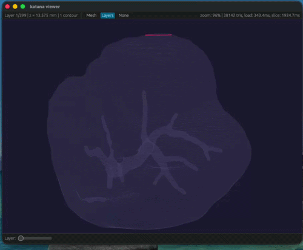

# Katana - Rust-based 3D slicer

[_Work in progress_]

This workspace contains 3 programs:
1. `katana-core` - Application that processes STLs and slices them
2. `katana-cli` - CLI interface for katana-core
3. `katana-viewer` - GUI application based on `eframe` (for the interface) and `glow` (for GPU rendering with OpenGL) to visualize the slices.

  

## Getting started

- `cargo build`
- `cargo run -p katana-viewer -- stls/liver.stl`

## TODO list
- [X] SLT parsing (bin and ASCII)
- [X] Parameterizes slicing and toolpathing powered by `nalgebra` and `i_overlay`
- [X] Rectilinear infill
- [X] GPU-rendered visualizer built on `eframe` and `glow`
- [X] Rendering toolpaths with thickness
    - [ ] Fix bug where filaments are clipped by next layer
- [ ] :loading: Calculate travel moves and segment connections
    - [ ] Fix issue where all layer travels start from 0,0
- [ ] G-code export
- [ ] Add more infill patterns