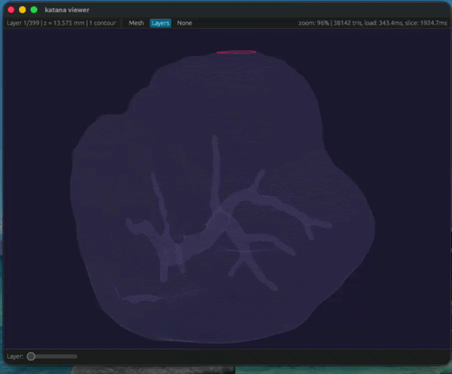

# Katana - Rust-based 3D slicer

[_Work in progress_]

This workspace contains 3 programs:
1. `katana-core` - Application that processes STLs and slices them
2. `katana-cli` - CLI interface for katana-core
3. `katana-viewer` - GUI application based on `eframe` (for the interface) and `glow` (for GPU rendering with OpenGL) to visualize the slices.

  

## Getting started

- `cargo build`
- `cargo run -p katana-viewer -- stls/liver.stl`

## TODO list
- [X] SLT parsing (bin and ASCII)
- [X] Parameterizes slicing and toolpathing powered by `nalgebra` and `i_overlay`
- [X] Rectilinear infill
- [X] GPU-rendered visualizer built on `eframe` and `glow`
- [X] Calculate travel moves and segment connections
    - [X] Fix issue where all layer travels start from 0,0
- [X] Horizontal slider
    - [X] Render scrubber nozzle
- [X] G-code export
    - [ ] Add BambuSlicer compatibility
- [ ] UI overhaul
    - [ ] Select file to slice
    - [ ] Add "slice" button (default open just mesh)
    - [ ] Add controls in UI for slicing params
- [ ] Add head bed rendering and model translation + rotation before slicing
- [ ] Add more infill patterns
- [ ] Add support for supports
- [ ] Retraction
- [ ] Seam placement
- [ ] Skirts
- [ ] Brims
- [ ] Prime tower

### Bugs to fix
- [ ] Fix origin point of exported G-code
- [X] Fix slicing artifacts
    - [X] Surfaces below max z don't get surface infill
    - [X] Holes in the top layer get covered by surface infill
    - [X] Liver slice artifact on layer 280

### Rendering performance improvements
- [X] ~Implement instanced rendering to avoid loading 20gb of triangle meshes into memory~
- [X] ~Use impostor rendering to render instances with 1 quad each instead of tens of vertices~
- [X] Migrate renderer to WebGPU!
    - [X] Implement wgpu performance improvements

### Rendering quality improvements
- [X] Rendering toolpaths with thickness
- [X] Fix bug where filaments are clipped by next layer
- [X] Hide tube insides with ball geometry
    - [X] Fix issue where smooth curves look like a bunch of balls
    - [X] Replace tubes with rhombuses following Bambu approach